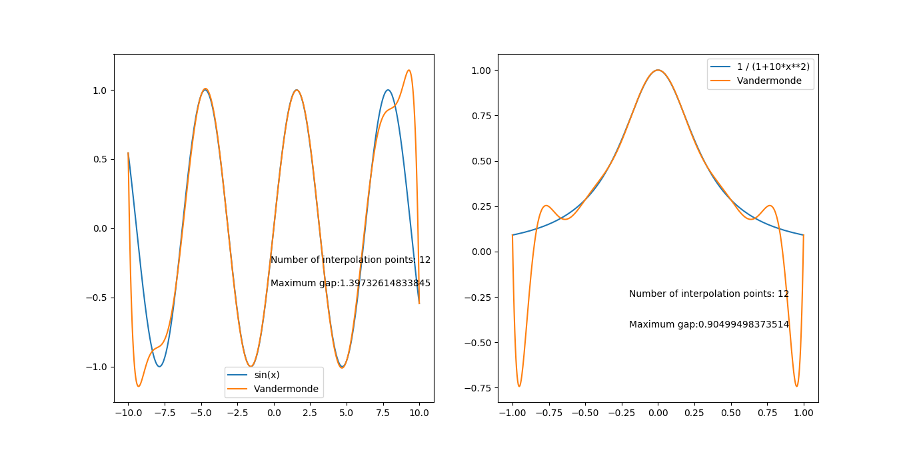
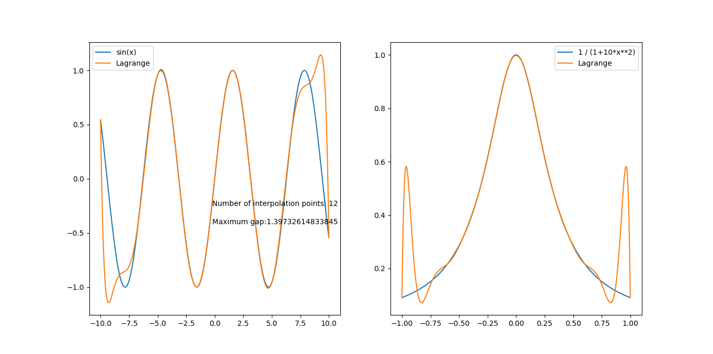
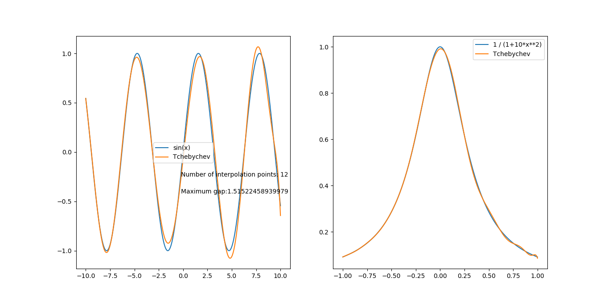

---
title: MA4I12 - Rapport TP1
author: Adeline KEOPHILA - Erwan MAUGERE - Romain GILLE
date: \today
geometry: margin=0.8in
...

\newpage

# Explication des fonctions

## Fonctions de calcul

```python
def createList(a, b, n):
    X = []
    step = (b - a) / n
    for i in range( n+1 ):
        X.append(a)
        a += step
    return X
```

La fonction `createList` permet de créer une liste de `n` éléments
entre `a` et `b`. Elle est utilisée dans nos fonctions d'affichage
de Vandermonde et de Lagrange.


### Vandermonde

```python
def vandermonde(X, Y, x):
    V = []
    for i in range( len(X) ):
        V.append( [ X[i] ** j for j in range( len(X) ) ] )
    A = np.linalg.inv(V).dot(Y)

    P = 0
    for i in range(len(A)):
        P += A[i] * x ** i
    return P
```

La fonction `vandermonde` exécute l'algorithme de Vandermonde sur
les tableaux `X` et `Y` pour une valeur de x donnée et retourne `P` en
résultat de cet algorithme. Cette fonction est utilisée dans notre fonction
`displayVandermonde` pour calculer les valeurs nécessaires à l'affichage de
notre courbe.


### Lagrange

```python
def lagrange(X, Y, x):
    P = 0
    for i in range( len(X) ):
        L = 1
        for j in range( len(X) ):
            if j != i:
                L = L * (x - X[j]) / (X[i] - X[j])
        P += L * Y[i]
    return P
```

Cette fonction retourne le résultat de l'algorithme de Lagrange sur les
tableaux `X` et `Y` pour une valeur `x` donnée. Couplé à la fonction
`createList`, elles permettent d'obtenir un tableau de valeur traitées par
l'algorithme de Lagrange.

\newpage

###  Tchebychev

```python
def createTchebychev(a, b, n):
    X = []
    for k in range( n+1 ) :
        x = (a+b) / 2 + (b-a) / 2 * cos( ( 2*k+1 ) * pi / (2*n+1) )
        X.append(x)
    return X
```

La fonction `createTchebychev`, comme la fonction `vandermonde` permet de
retourner les valeurs nécessaire à l'affichage de la courbe pour chacun des
algorithmes demandés. Celle-ci retourne un tableau de `n` valeurs entre `a` et
`b`, `n`, `a` et `b` passés en argument de cette fonction. On applique à ces
valeurs la formule de Tchebychev avant de les retourner dans le tableau `X`.


## Fonctions d'affichage

```python
def display(X, Y, gap, P, n, labelFnt, labelP, subplotNumber):
    plt.subplot(subplotNumber)
    plt.plot(X, Y, label=labelFnt)
    plt.plot(X, P, label=labelP)
    plt.legend()
    plt.text(-0.2, -0.25, "Number of interpolation points: " + str(n))
    plt.text(-0.2, -0.42, "Maximum gap:" + str( gap ))
```

Cette fonction permet de préparer la fenêtre qui servira pour l'affichage des
courbes.


### Vandermonde

```python
def displayVandermonde (a, b, fnt, label, subplotNumber, n, N):
    # fnt used for calculations
    xCalc = createList(a, b, n)
    yCalc = [ fnt(x) for x in xCalc ]
    # fnt used for drawing
    xDisplay = createList(a, b, N)
    yDisplay = [ fnt(x) for x in xDisplay ]
    # calc Vandermonde
    P = [ vandermonde(xCalc, yCalc, x) for x in xDisplay ]
    display(xDisplay, yDisplay, maxGap(yCalc, yDisplay), P, n, label, "Vandermonde",
        subplotNumber)
```

La fonction `displayVandermonde` crée des tableaux de valeurs pour le calcul
et l'affichage (`xCalc` et `xDisplay`) puis leur applique une fonction pour
obtenir une courbe qui servira de référence. On leur applique ensuite la
fonction de Vandermonde et on les affiche grâce à la fonction `display`.

\newpage

### Lagrange

```python
def displayLagrange (a, b, fnt, label, subplotNumber, n, N) :
    # fnt used for calculations
    xCalc = createList(a, b, n)
    yCalc = [ fnt(x) for x in xCalc ]
    # fnt used for drawing
    xDisplay = createList(a, b, N)
    yDisplay = [ fnt(x) for x in xDisplay ]
    # calc Lagrange
    P = [ lagrange(xCalc, yCalc, x) for x in xDisplay ]
    display(xDisplay, yDisplay, maxGap(yCalc, yDisplay), P, n, label, "Lagrange",
        subplotNumber)
```

La fonction `displayLagrange` procède comme `displayVandermonde` mis à part que
l'on applique la fonction de Lagrange à la place de la fonction de Vandermonde.


### Tchebychev

```python
def displayTchebychev(a, b, fnt, label, subplotNumber, n, N):
    # fnt used for calculations
    xCalc = createTchebychev(a, b, n)
    yCalc = [ fnt(x) for x in xCalc ]
    # fnt used for drawing
    xDisplay = createTchebychev(a, b, N)
    yDisplay = [ fnt(x) for x in xDisplay ]
    # calc Lagrange
    P = [ lagrange(xCalc, yCalc, x) for x in xDisplay ]
    display(xDisplay, yDisplay, maxGap(yCalc, yDisplay), P, n, label, "Tchebychev",
        subplotNumber)
```

Finalement la fonction `displayTchebychev` crée deux tableaux (`xCalc` et
`xDisplay`) à partir de la fonction `createTchebychev`. On leur applique
ensuite une fonction qui servira de référence puis on applique la fonction de
Lagrange. On affiche ensuite le résultat grâce à la fonction `display`.

\newpage

# Résultats

Sur les trois graphiques ci-dessous, on met côte à côte le sinus et le
polynôme $1 \over {1 + 10 . x^2}$ (les courbes bleues) ainsi que les fonctions
citées précédemment (les courbes oranges).









\newpage

# Interprétation des résultats

Le but de ce TP était de trouver un polynôme d'interpolation qui suit au mieux
la fonction qui lui est donné en paramètre (`sinus` et $1 \over{1+10.x^2}$).

Pour Vandermonde et Lagrange, on a pu remarquer que les courbes
d'interpolations avaient des difficultés à suivre correctement les courbes des
fonctions aux extrémités : c'est ce qu'on appelle le phénomène de Runge.
On a pu résoudre ce problème en utilisant la formule de Tchebychev.

En appliquant Tchebychev, puis l'algorithme de Lagrange, on trouve un polynôme
plus fidèle à la fonction originelle.
