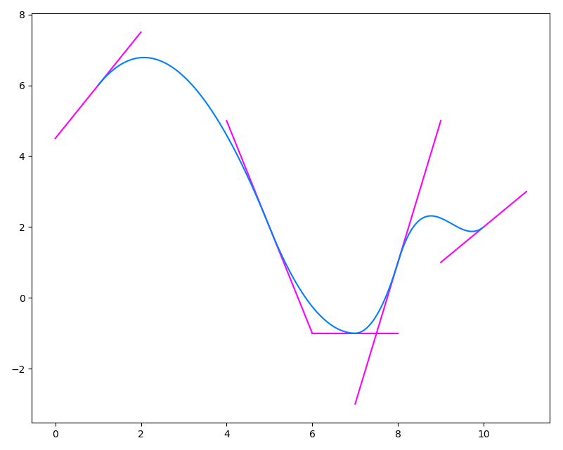

---
title: MA4I12 - Rapport TP2
author: Adeline KEOPHILA - Erwan MAUGERE - Romain GILLE
date: \today
geometry: margin=0.8in
...

\newpage

# Explication des fonctions

Sur l'intervale $]-\infty; 0[$ $\cup$ $]1; + \infty[$

$$\phi_{1}(x) = (x - 1)^2 \times (2 . x + 1)$$
$$\phi_{2}(x) = x^2 \times (3 - 2 . x)$$
$$\phi_{3}(x) = x \times (x - 1)^2$$
$$\phi_{4}(x) = x^2 \times (x - 1)$$

Les fonctions `phi1`, `phi2`, `phi3`, `phi4` retournent `0` si la valeur passée
en paramètre est inférieure à `0` ou supérieur à `1` sinon elle retourne
respectivement le résultat des fonctions ci-dessus.


## Fonction Hermite

```python
def foncHermite(X, Y, V, x):
    P = 0
    for k in range(len(X)-1):
        d = X[k+1] - X[k]
        t = (x - X[k]) / d
        P += Y[k] * phi1(t) + Y[k+1] * phi2(t) + d * (V[k] * phi3(t) + V[k+1] * phi4(t))
    return P
```

Dans cette fonction, on retourne le polynôme d'Hermite créé à partir des
valeurs passées en argument ainsi que des fonctions `phi` présentées
précedemment en suivant le modèle :

$$P = \sum_{0}^{len(X)-1}{Y[k] . \varphi_1(t) + Y[k+1] . \varphi_2(t) +
d (V[k] . \varphi_3(t) + V[k+1] . \varphi_4(t))}$$


## Fonction tangente

```python
def tangentes(X, Y, V):
    for k in range(len(X)):
        Xtan = [X[k] - 1, X[k] + 1]
        Ytan = [Y[k] - V[k], V[k] + Y[k]]
        draw(Xtan, Ytan, '#ff00ff')
```

Cette fonction permet de dessiner les tangentes pour toutes les valeurs de `X`
et de `Y`.

\newpage


# Résultats

Sur le graphique ci-dessous, on observe la fonction d'Hermite
(`foncHermite(X, Y, V, x)`) avec pour données d'entrée : 

* `X = [1, 5, 7, 8, 10]`
* `Y = [6, 2, -1, 1, 2]`
* `V = [3/2 , -3, 0, 4, 1]`
* `x = min(X) + k  * (max(X) - min(X) / N)`

Pour `N = 500`, et `k = (0, 1, 2, ..., N)`




# Interprétation des résultats

PLOP
