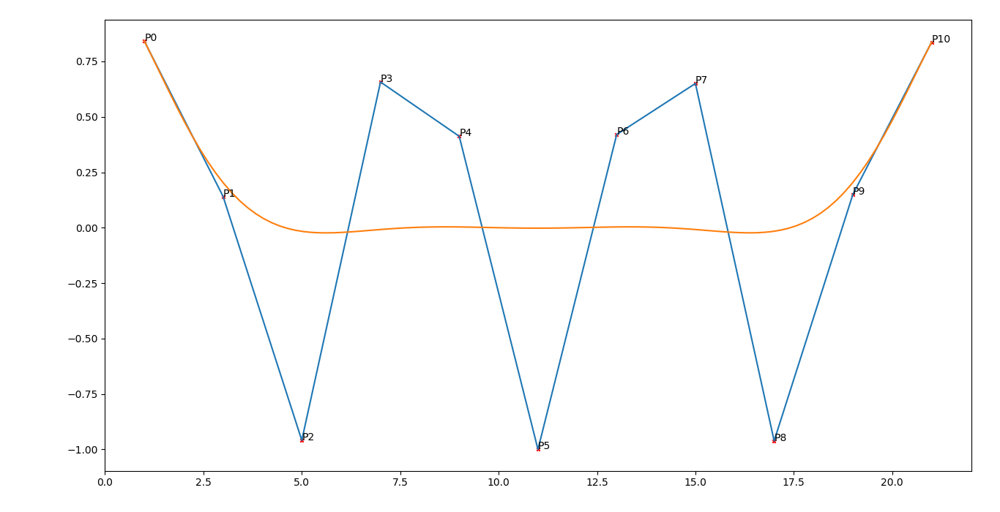

---
title: MA4I12 - Rapport TP3
author: Adeline KEOPHILA - Erwan MAUGERE - Romain GILLE
date: \today
geometry: margin=0.8in
...

\newpage

# Explication des fonctions

## Fonctions générales

### Fonction Binom

```python
def binom(n,p):
    return factorial(n) / ( factorial(p) * factorial(n-p) )
```

La fonction `binom` retourne le coefficient binomial des deux valeurs passées
en argument en suivant le modèle suivant

$$\binom{n}{p} = \frac{n!}{p! \times (n - p)!}$$

### Fonction Point

```python
def point(pts, t):
    n = len(pts)
    x = [ pts[i][0] * bernstein(n-1, i, t) for i in range(n) ]
    y = [ pts[i][1] * bernstein(n-1, i, t) for i in range(n) ]
    return ( sum(x), sum(y) )
```

La fonction `points` applique la fonction `bernstein` sur les coordonnées,
passées dans le tableau de points en paramètre, pour une valeur de `t` donnée.
Elle retourne ensuite un point qui est la somme de toutes les coordonnées.

## La fonction de Bernstein

```python
def bernstein(n, i, t):
    return binom(n, i) * t ** i * (1 - t) ** (n-i)
```

La fonction `bernstein` retourne le résultat de la formule de Bernstein pour
une valeur `t`

$$\binom{n}{i} \times t^i \times (1 - t)^{n - i}$$

## La fonction de Bézier

```python
def bezier(pts):
    return [ point(pts, t) for t in np.linspace(0, 1, 100) ]
```

La fonction `bezier` retourne un tableau de points permettant de représenter la
courbe de Bézier.

\newpage

# Résultats

Ci-dessous on peut observer la courbe de Bézier (orange) créée à partir des
points représentés par une croix rouge.


