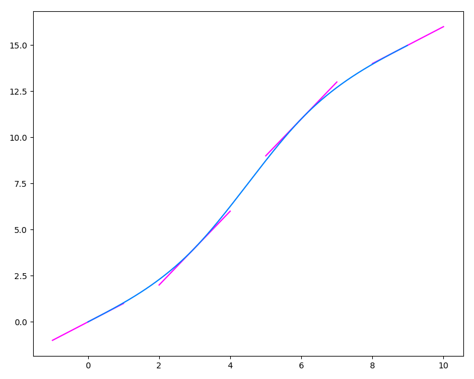

---
title: MA4I12 - Rapport TP4
author: Adeline KEOPHILA - Erwan MAUGERE - Romain GILLE
date: \today
geometry: margin=0.8in
...

\newpage


# Explication des fonctions

Dans ce TP4 nous utilisons les fonctions créées dans le TP2. Vous pouvez
trouver plus d'informations sur ces fonctions dans le rapport correspondant.


## Le vecteur B

```python
def vecteurB (Y, d, n):
    b = [ (3/d) * (Y[1]-Y[0]) ]
    for i in range(2, n):
        b.append( (3/d) * (Y[i] - Y[i-2]) )
    b.append( (3/d) * (Y[n-1] - Y[n-2]) )
    return b
```

Cette fonction permet de créer le vecteur $B$ qui permettra d'obtenir ensuite
le vecteur $V$.


## La matrice M

```python
def matriceM(n):
    M = [[0 for x in range(n)] for y in range(n)]
    M[0][0] = M[n-1][n-1] = 2
    M[0][1] = M[n-1][n-2] = 1

    for i in range(1, n-1):
        M[i][i] = 4
        M[i][i+1] = M[i][i-1] = 1

    return M
```

Cette fonction permet de créer la matrice $M$ qui permettra ensuite d'obtenir
le vecteur $V$.

## Le vecteur V

```python
def vecteurV(M, B):
    return np.linalg.solve(M, B)
```

Finalement, cette fonction nous permet de créer le vecteur $V$ à partir de la
matrice $M$ et du vecteur $B$.

\newpage

# Résultats


